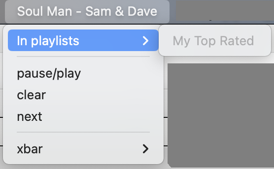

# mpd-xbar

This is a basic demo of an [MPD (Music Player Demon)](https://www.musicpd.org/) plugin for [XBar](https://xbarapp.com/).

Note this is really just a demo - I have a more complex version for my own use, but it has lots of ugly bits that aren't worth sharing.

If you just want an MPD widget, there's [mpd control](https://xbarapp.com/docs/plugins/Music/mpd-control.20s.sh.html) [(source)](https://github.com/matryer/xbar-plugins/blob/main/Music/mpd-control.20s.sh) which gives a basic widget in 8 lines of bash - much simpler!

This plugin is written in rust - you need a working rust toolchain to run it, see [https://rustup.rs/](https://rustup.rs/) to get started.

## What is XBar ?

[XBar](https://xbarapp.com/) is a nifty tool for Mac OSX machines which puts status widgets (aka plugins) on your toolbar - and it is very easy to code such widgets, as it uses a Unix-philosophy approach where each tool just uses the command line and STDOUT for all I/O, and environment variables for all configuration.

XBar started as an older project called Bitbar, which was abandoned for a while - during which time some folk wrote an alternative called [SwiftBar](https://github.com/swiftbar/SwiftBar) which also looks good.  The original Bitbar author has since released XBar which, while a bit buggy, works fine for my purposes.

## What does this plugin do ?

It queries mpd and shows a simple drop-down UI:



This shows:

- The currently playing track
- Any playlists that contain this track
- Buttons to toggle pause/play, clear the playlist, and skip to next track

Note this is quite inefficient - every single time it updates the UI it re-loads all playlists.  A future optimisation might be to cache this information; it performs OK on my machine but might be very slow on a remote installation.

All menu actions are delegated to `mpc` - which is nice as I don't need to implement any kind of command handling.

## Installation

### Installing dependencies

First, [you need to install xbar](https://xbarapp.com/) - naturally you also need [mpd](https://www.musicpd.org/) and mpc installed.

XBar depends on running scripts from a "plugins" directory - on a current OSX version this will be `~/Library/Application\ Support/xbar/plugins/` - you can check this by installing xbar then selecting "Open plugins folder" from an xbar widget.

The plugin is built as a rust script - rust is normally a compiled language, to make it run [shebang-style](https://en.wikipedia.org/wiki/Shebang_(Unix)) scripts you need to install [rust-script](https://rust-script.org/) - you can install this using `cargo` if you have rust installed:

```sh
cargo install rust-script
```

Or you can use homebrew to install it. I'd suggest using cargo as above - if you use homebrew you'll need to adjust the shebang line in the script.

### installing the plugin

The script in [src/main.rs](./src/main.rs) can be run with rust-script - just execute it

```sh
chmod +x src/main.rs # probably not needed
./src/main.rs
```

To install it, just copy `main.rs` to the plugin directory - but you'll need to rename it to a name that includes a refresh time:

```sh
cp $(pwd)/src/main.rs ~/Library/Application\ Support/xbar/plugins/001-mpd-xbar.1m.rs
```

The `.1m` part of the name is critical - xbar uses the suffix to tell how often to refresh the plugin.  A file named  `name.<time>.suffix` will refresh based on the time interval - in this case `1m` means "refresh every 1 minute".

Once you have copied the script, start xbar, then on any xbar plugin you should have a submenu "xbar" - select that, then "refresh all", and the new plugin should show up. You can also select `xbar/plugin browser...` to open the plugin browser.

You might need to press `reload ↻` to make sure the new plugin is shown. You should see a simple config UI like this:


Optionally you can enter an `MPD_XBAR_DIR` directory - this enables logging, and advanced configuration options. You need to refresh the plugin if you set this.

xbar sometimes freezes in mysterious ways when installing or updating plugins - if in doubt, `killall -9 xbar` and see if it refreshes when you re-start it.

You can also change the refresh interval in the UI - note this actually renames your script, so be careful if you want to make changes to it later.

### Logging

One limitation of how xbar works is that everything that goes to STDOUT is interpreted as UI settings. So for more information you need to configure a log file.

If you set a valid `MPD_XBAR_DIR` directory, the plugin will create a log file `mpd-xbar-demo.log` in that directory, and append to it every time it refreshes.

I plan to add the option for config files in that directory as well, in the future.

### A note on the shebang line

The [main.rs](./src/main.rs) file starts with a complex shebang line:

```sh
#!/usr/bin/env -S PATH=/Users/${USER}/.cargo/bin:${PATH} rust-script
```

This is needed because XBar doesn't get access to the normal user's path - so it can't find `rust-script`. The `-S PATH` part adds `~/cargo/bin` to the path, which should make it work.  If you install `rust-script` using homebrew, you'd need to use homebrew's path instead.
